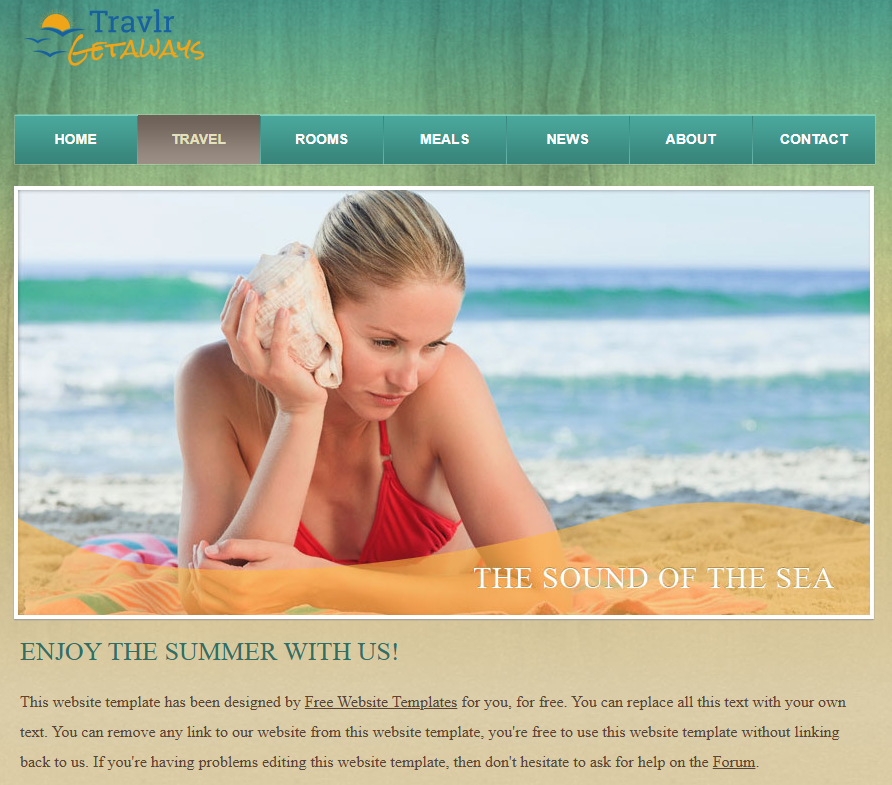
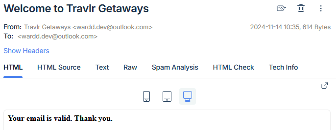
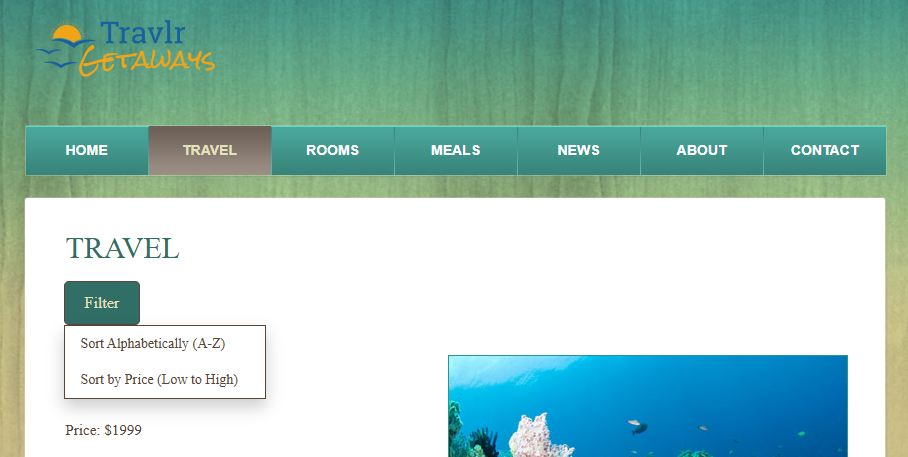
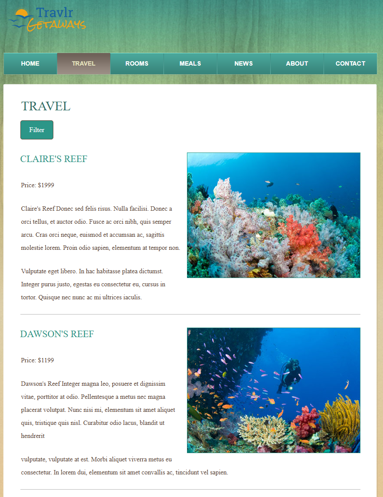
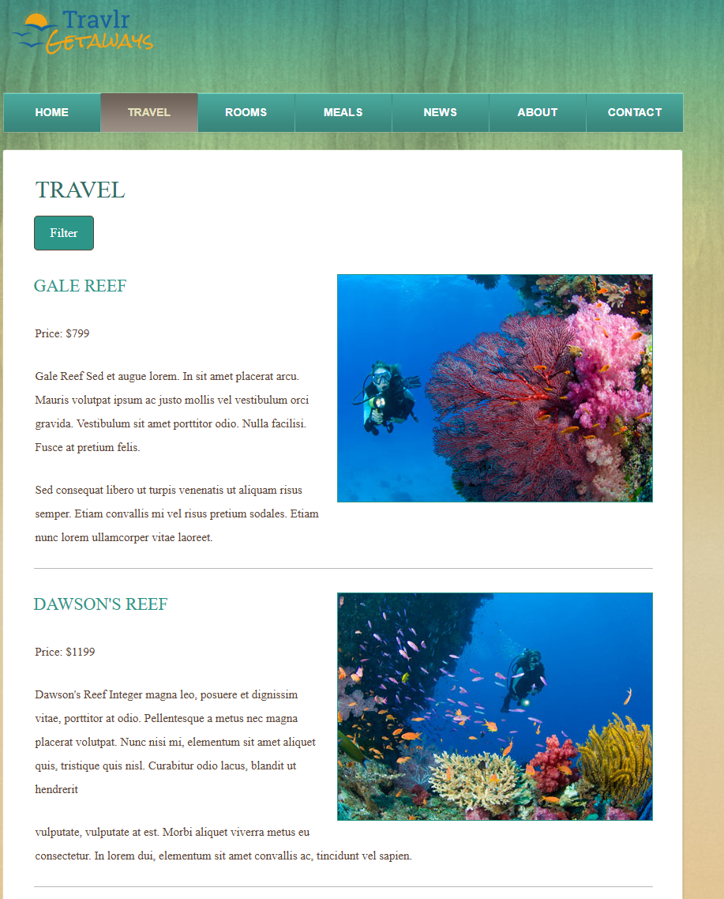
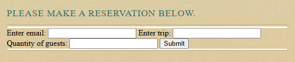
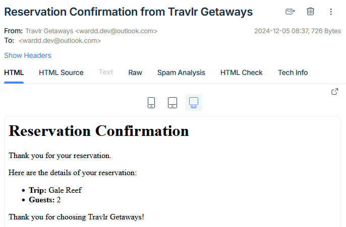

# **Introduction**
Welcome to my ePortfolio, a showcase of the skills and knowledge I developed during my journey through SNHU's Computer Science program. The artifact and enhancements presented here demonstrate the growth in my abilities.

## **Table of Contents**

1. [Professional Self-Assessment](#professional-self-assessment)
2. [Original Artifact](#original-artifact)
3. [Code Review](#code-review)
4. [Enhancements](#enhancements)

# **Professional Self-Assessment**
This ePortfolio is the final product of this Computer Science program. I started this program in 2000 to finish at the end of 2024. The original trajectory I sought was a career in software development, but my interest has changed to working in Cybersecurity. This program has helped me narrow my passion from the broad spectrum of computer science to discovering this importance of this field. I hope to bring the skills and knowledge to benefit future employers and users.

The program has educated me in a variety of soft, or transferrable, skills I will be able to take with me to any workplace. There have been many instances of team collaboration and the use of GIT for version control. This experience improved my ability to collaborate with my team, resolve conflicts, and implement ideas effectively. A specific example of team collaboration was my professional introduction to GIT in practicing version control, the specific mechanics of GIT, and code reviews. We would individually develop a feature to an existing mobile application and then submit a pull request to the team. Another member of the team would perform a code review after they developed their own feature for review. It was a wonderful experience to be apart of the work flow and gather valuable experience. I learned how to give and receive constructive feedback. It overall prepared me for effective teamwork in the professional environment.

Another soft skill I developed experience with is communicating with stakeholders. The stakeholders were played by the professor and peers who reviewed submitted code blocks and, more importantly, my supporting documentation. In an academic environment, real workplace experiences such as developing documentation for presentation and creating effective communication devices can be overlooked. This experience will be directly used in the transition to the professional world and applied to emails, presentations, reports, and any form of communication. Stakeholders are not always directly knowledgable with the specifics of each team, so knowing how to translate and communicate is all the more important for multiple teams to come together. I know feel familiar with tailoring communication to different audiences, such as peers or stakeholders.

Hard skills are technical and specifically relating to computer science and its many fields. This includes the wide range of computer languages this program has exposed us to, such as Java, C++, and Python. Data structures and algorithms also falls under hard skills. This knowledge is understanding and applying the many forms data can be stored in and algorithms to solve different problems. These computer languages rely on implementing various data structures, such as linked lists, hash tables, graphs, and more. Each data structure has an area it excels in and knowing the differences promotes efficiency and best software development practices. Algorithms like sorting and searching follow the same logic as they perform very differently when applied to a problem.

Software engineering and databases emphasizes the importance of best practices. Software engineering encourages effective approaches such as modular programming where a program's functionality is broken down into modules that are designed to perform only the specific function. This design technique allows efficient teamwork, understandability, reusability, and updating. An example of this is implementing CRUD operations in my full-stack web application. Each function of the CRUD operation is contained so I have more control in modifications and readability. Databases have similar best practices in designing schemas and queries. The MongoDB database developed for the same application uses the best practice of managing data integrity. This is achieved through validating and sanitizing user input data before committing entries to the database.

The deployment of Security principles protect confidential data and users from threat actors. Companies have a legal and moral obligation to follow industry standards to prevent financial damages to the many involved parties. Specific security concepts are encryption, authentication, and user access levels. Encrypting sensitive data is an important step in protecting valuable assets. Authentication and user access levels enable control over who has access to specific data. An example of this is storing and encrypting SMTP credentials like I did with the full-stack web application.

These experiences have prepared me to contribute effectively in the professional environment, communicate clearly, and develop secure, efficient software solutions.

# **Original Artifact**
[Link to Artifact Repository](https://github.com/wardddev/cs465-fullstack/tree/main)

The artifact that will be enhanced is a full-stack web application called Travlr Getaways. This application was originally created as a college project during the course CS465-Full Stack Development 1 from 09/2024 to 11/2024. It's built using the MEAN stack which stands for the JavaScript technologies MongoDB, Express.js, Angular, and Node.js. It is designed as a travel booking site for customers to browse and book travel packages. Customers can create accounts and look through travel locations, rooms, and more. There is also an admin-only SPA for maintaining customer accounts, travel packages, and items within.

*Figure 1 - Admin Main Page*

*Figure 2 - User Main Page*

This full-stack web application was selected for my ePortfolio because it represents an accumulation of skills acquired through the Computer Science program, including:
- Team Collaboration: Using Git for version control and conducting code reviews.
- Documentation: Creating detailed README files for clients and stakeholders.
- Data Structures and Algorithms: Efficiently storing user accounts and trip data.
- Software Engineering: Implementing modular functions for CRUD operations.
- Security: Validating and sanitizing user inputs, and storing credentials securely.
This project highlights my ability to integrate frontend and backend technologies, manage databases, and ensure security best practices.

This application was designed and developed while collaborating with my previous professor and peers. I used GIT for version control and creating feature branches so my code could be pull requested and reviewed. I created detailed supporting documentation including a README file for the client, stakeholders, and peers. I applied my knowledge of data structures and algorithms to properly store different forms of data such as user accounts and trip information. I applied the best practices of software engineering and databases by creating modular-based functions and developing different levels of user access through the admin-only Single Page Application that can be used to manage trips and user accounts stored in the MongoDB database. There are several security practices that I applied to this application. The first is validating and sanitizing all user input, such as email addresses, to prevent injection attacks and malicious data entries. Important credentials like the SMTP credentials for the email service are encrypted and stored as environment variables.

The program also presents the skills full-stack web app development, API integration, database management, and using frameworks for front-end and back-end like Angular and Express. The database management component displays working with MongoDB to store and query data on trips, user logins, and more. The API integration component involves using Node.js and Express.js to process requests for data and retrieve them from the database. Using the different frameworks in the MEAN stack, like Angular and Express, also shows efficiency in handling endpoints and HTTP methods so that data can be processed from the front-end to back-end and back.

# **Code Review**

# **Enhancements**

## **Software Engineering and Design**
The artifact was improved with the implementation of the mailing service. This service allows a user to enter their email in the homepage to receive a welcome email from Travlr Getaways. Once the user enters their email, a JavaScript sends a POST request to the RESTful API after validating the data. This request is validated on the back-end Node.js server as well then calls the mailing service to send an email using NodeMailer. A response on is sent back to the front-end to confirm to user if the email was successful. For a testing and debugging environment, emails are captured using mailtrap.

*Figure 3 - Mailing Service Example*

One course outcome achieved in this enhancement is “Demonstrate an ability to use well-founded and innovative techniques, skills, and tools in computing practices for the purpose of implementing computer solutions that deliver value and accomplish industry-specific goals”. This goal was met in several ways, but primarily in:
- The use of using third-party services such as mailtrap for creating a testing and debugging environment where outputs could be contained.
- Through compartmentalizing functions to be called such as mailing.js containing the mailing service script to be called in the HTML homepage.
- Validating and sanitizing user inputs both in the front-end and data entering the back-end. This was done using the npm validation module.

The course outcome "Employ strategies for building collaborative environments that enable diverse audiences to support organizational decision making in the field of computer science" is also achieved here. Version control is an important part of software engineering and design to create a collaborative environment. For development, I used GIT and code reviews to effectively communicate with team members.

Similarly the course outcome "Design, develop, and deliver professional-quality oral, written, and visual communications that are coherent, technically sound, and appropriately adapted to specific audiences and contexts" is followed through the use of the different communication devices. These devices include the code review, comments, and attached technical documentation like the README file within the repository.

In the process of applying this enhancement, I faced several challenges and learned a great deal. The process to enhance the artifact involved researching brand new topics on the intended functions never used before. The mailing service uses nodemailer to send emails in the Node.js server to SMTP provider mailtrap for safely testing and debugging during development. This involved learning SMTP and the process of mail transmission. There were many challenges that came from this, but the primary one was debugging failed email transmissions. The solution was to use Postman to send POST requests. This narrowed down if the errors received were a disconnect between the front-end to back-end or back-end to the SMTP provider.

## **Algorithms and Data Structures**
The artifact was enhanced to add the sorting functionality for the travel page displayed to the user. The original artifact retrieved a list of all trips to be displayed to the user. With the new sorting function, the user can choose the preferred way to list the trips through alphabetically (A-Z) or pricing (Low to High). The sorting options are presented to the user in a dropdown menu.

*Figure 4 - Dropdown Menu Example*

*Figure 5 - Alphabetical Sorting Example*

*Figure 6 - Price Sorting Example*

Another course outcome achieved in this enhancement is “Design and evaluate computing solutions that solve a given problem using algorithmic principles and computer science practices and standards appropriate to its solution while managing the trade-offs involved in design choices”. The reason this course outcome was achieved was through the development and application of the sorting function. The first approach I had was to create multiple functions to be called for each type of travel list I wanted to provide to the user, such as tripListAlphabetically, tripListPricingLowToHigh, etc. The problem was the redundancies and duplicated logic. By applying the algorithmic principles and computer science practices, I realized it was more efficient to modify the existing GET tripList to use the existing parameters in the database to sort and then a direction of up/down. By consolidating multiple sorting functions into a single function that could be adjusted to different parameters, I reduced redundancy and improved maintainability.

With this enhancement, several challenges and learning moments revealed themselves. The first was updating my existing functions to handle more parameters and running through the entire program to confirm handling down the line. A challenge encountered that I have never dealt with in my limited experience in MongoDB was updating the existing trip schema to update perPerson from string to integer. The process was painfully simple, but caused multiple errors because it was not caught until I realized the price sorting was displaying trips out of order. Because the sorted lists seemed to be operating properly, a simple mistake caused me a huge headache because I was overthinking my massive modifications to the existing functionalities.

## **Databases**
The artifact was expanded with this third enhancement focusing on databases. This enhancement took the previous mailing service enhancement and added even more functionality. The general function added is a reservation system which allows users to submit a reservation form and receive confirmation the form was received. The server takes the submitted form, validates and sanitizes it, and then saves the reservation to the database. The server then generates and sends an email containing a read-back of the reservation to the user’s submitted email, as well as a confirmation message within the user’s browser.

*Figure 7 - User Reservation & Mailing Service Example*

*Figure 8 - Reservation Email Example*

The last course outcome achieved in this enhancement is “Develop a security mindset that anticipates adversarial exploits in software architecture and designs to expose potential vulnerabilities, mitigate design flaws, and ensure privacy and enhanced security of data and resources”. The reservation enhancement used user input validation and sanitization to prevent errors or malicious intent. This mitigated potential vulnerabilities like injection attacks or threat actors. The SMTP credentials were also stored using environmental variables to protect and secure this sensitive data.

In the process of applying this enhancement, I faced several challenges and learned a great deal. This enhancement was not only on the existing artifact, but on a previous enhancement. I learned how to constantly progress and evolve the web application by taking existing functions and re-purposing them. Similar to previous enhancements, I learned more about full-stack development and dealing with increasingly larger projects. A challenge I faced was realizing the commenting and documentation of my previous enhancement one was not sufficient for even the original developer, myself, to jump in and understand. I took more time organizing my project as well as optimizing code blocks and documentation. Improving documentation not only helped me understand my own code better, but also prepared me for team collaboration.
