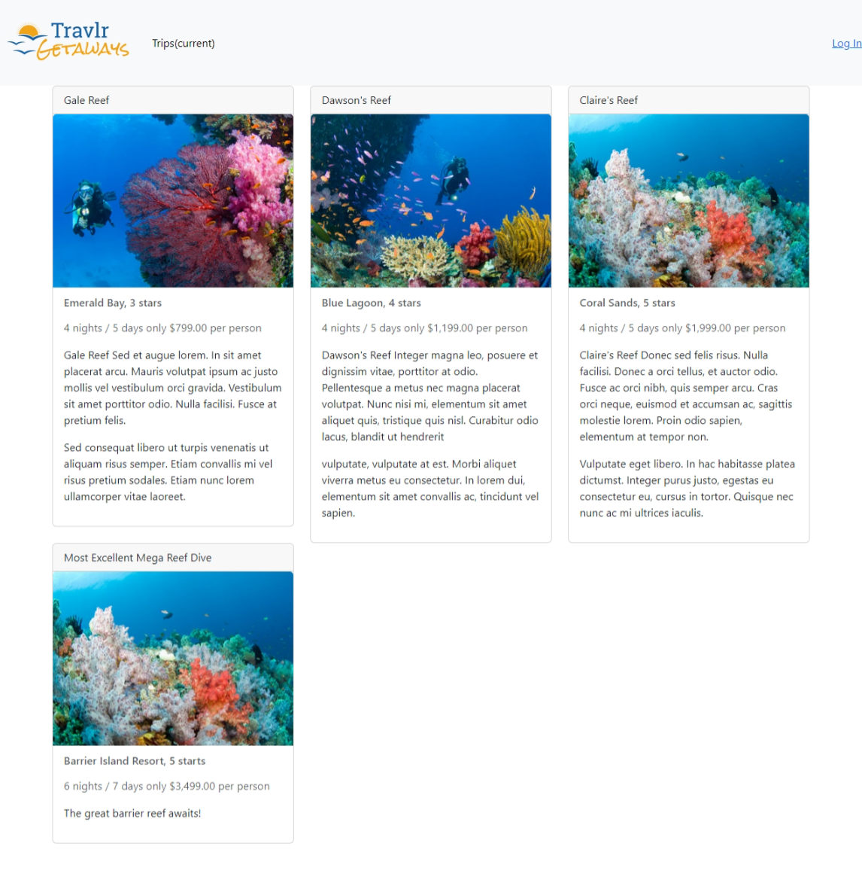

# **Introduction**
Hello, this ePortfolio is a showcase of skills developed during SNHU's Computer Science program. 

## <u>Table of Contents<u>

# **Professional Self-Assessment**
This ePortfolio is the final product of this Computer Science program. I started this program in 2000 to finish at the end of 2024. The original trajectory I sought was a career in software development, but my interest has changed to working in Cybersecurity. This program has helped me narrow my passion from the broad spectrum of computer science to discovering this importance of this field. I hope to bring the skills and knowledge to benefit future employers and users.

The program has educated me in a variety of soft, or transferrable, skills I will be able to take with me to any workplace. There have been many instances of team collaboration and the use of GIT for version control. This exposure shaped my ability to work alongside my team and avoid conflict with ideas and implementation. A specific example of team collaboration was my professional introduction to GIT in practicing version control, the specific mechanics of GIT, and code reviews. We would individually develop a feature to an existing mobile application and then submit a pull request to the team. Another member of the team would perform a code review after they developed their own feature for review. It was a wonderful experience to be apart of the work flow and gather valuable experience. I learned how to give and receive constructive feedback. It overall prepared me for effective teamwork in the professional environment.

Another soft skill I developed experience with is communicating with stakeholders. The stakeholders were played by the professor and peers who reviewed submitted code blocks and, more importantly, my supporting documentation. In an academic evironment, real workplace experiences such as developing documentation for presentation and creating effective communication devices can be overlooked. This experience will be directly used in the transition to the professional world and applied to emails, presentations, reports, and any form of communication. Stakeholders are not always directly knowledgable with the specifics of each team, so knowing how to translate and communicate is all the more important for multiple teams to come together. I know feel familiar with tailoring communication to different audiences, such as peers or stakeholders.

Hard skills are technical and specifically relating to computer science and its many fields. This includes the wide range of computer languages this program has exposed us to, such as Java, C++, and Python. Data structures and algorithms also falls under hard skills. This knowledge is understanding and applying the many forms data can be stored in and algorithms to solve different problems. These computer languages rely on implementing various data structures, such as linked lists, hash tables, graphs, and more. Each data strcuture has an area it excels in and knowing the differences promotes efficiency and best software development practices. Algorithms like sorting and searching follow the same logic as they perform very differently when applied to a problem.

Software engineering and databases emphasizes the importance of best practices. Software engineering encourages effective approaches such as modular programming where a program's functionality is broken down into modules that are designed to perform only the specific function. This design technique allows efficient teamwork, understandability, reusability, and updating. An example of this is implementing CRUD operations in my full-stack web application. Each function of the CRUS operation is contained so I have more control in modifications and readability. Databases have similar best practices in designing schemas and queries. The MongoDB database developed for the same application uses the best practice of managing data integrity. This is achieved through validating and sanitizing user input data before committing entries to the database.

The deployment of Security principles protect confidential data and users from threat actors. Companies have a legal and moral obligation to follow industry standards to prevent financial damages to the many involved parties. Specific security concepts are encryption, authentication, and user access levels. Encrypting sensitive data is an important step in protecing valuable assets. Authentication and user access levels enable control over who has access to specific data. An example of this is storing and encrypting SMTP credentials like I did with the full-stack web application.

# **Original Artifact**
[Link to Artifact Repository](https://github.com/wardddev/cs465-fullstack/tree/main)

The artifact that will be enhanced is a full-stack web application called Travlr Getaways. This application was originally created as a college project during the course CS465-Full Stack Development 1 from 09/2024 to 11/2024. It's built using the MEAN stack which stands for the JavaScript technologies MongoDB, Express.js, Angular, and Node.js. It is designed as a travel booking site for customers to browse and book travel packages. Customers can create accounts and look through travel locations, rooms, and more. There is also an admin-only SPA for maintaining customer accounts, travel packages, and items within.

*Figure 1 - Admin Main Page*

*Figure 2 - User Main Page*

This full-stack web application was selected for my ePortfolio because it represents an accumulation of skills acquired through the computer science program. The program presents full-stack web app development, API integration, database management, and using frameworks for front-end and back-end like Angular and Express. The database management component displays working with MongoDB to store and query data on trips, user logins, and more. The API integration component involves using Node.js and Express.js to process requests for data and retrieve them from the database. Using the different frameworks in the MEAN stack, like Angular and Express, also shows efficiency in handling endpoints and HTTP methods so that data can be processed from the front-end to back-end and back.

# **Code Review**
Embedded Youtube Link

# **Enhancements**

## **Software Engineering and Design**
The artifact was improved with the implementation of the mailing service. This service allows a user to enter their email in the homepage to receive a welcome email from Travlr Getaways. Once the user enters their email, a JavaScript sends a POST request to the RESTful API after validating the data. This request is validated on the back-end Node.js server as well then calls the mailing service to send an email using NodeMailer. A response on is sent back to the front-end to confirm to user if the email was successful. For a testing and debugging environment, emails are captured using mailtrap.

## **Algorithms and Data Structures**
The artifact was enhanced to add the sorting functionality for the travel page displayed to the user. The original artifact retrieved a list of all trips to be displayed to the user. With the new sorting function, the user can choose the preferred way to list the trips through alphabetically (A-Z) or pricing (Low to High). The sorting options are presented to the user in a dropdown menu.

## **Databases**
The artifact was expanded with this third enhancement focusing on databases. This enhancement took the previous mailing service enhancement and added even more functionality. The general function added is a reservation system which allows users to submit a reservation form and receive confirmation the form was received. The server takes the submitted form, validates and sanitizes it, and then saves the reservation to the database. The server then generates and sends an email containing a read-back of the reservation to the user’s submitted email, as well as a confirmation message within the user’s browser.
